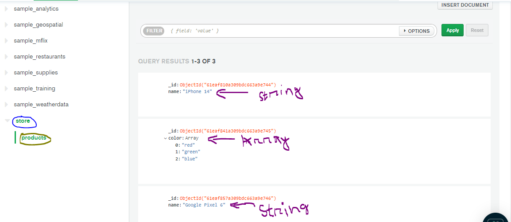

# HTTP Requests Types

## Terms

- Upsert - An operation that inserts rows into a database table if they do not already exist, or updates them if they do. Example:
- Insert - An operation that inserts rows into a database table does not chekcs if they exist or not. Example: Creating a new post in Facebook.

## HTTP Requests

- `POST` - Create NEW record
- `PUT` - If the record exists then update , else create a new record.
  - Replacing the record: use `PUT`. Does modifies values of other attributes as it replaces existing record. When using PUT, it is assumed that you are sending the complete entity, and that complete entity replaces any existing entity at that URI. When we create new document in the drive folder and it's already available we can replace that item, in Drive and it's available
- `PATCH` - update. If the record exists then update, otherwise send an error.
  - Updating a single attribute: use `PATCH`. Does not modifies values of other attributes.
    [PUT vs PATCH](https://stackoverflow.com/a/34400076/7828981)
- `GET` - read
- `DELETE` - delete

# How to find how many and which api need to be designed for a project?

Answer: for this to answer, just consider an app of single page, such as task manager project. Firstly if the ux design is available, see the design or scetch the design. Now mark where we need to interact with database or server?

1. When we want to got to a new page we need to interact with server. So the initial request of accessing the page is a get request.
2. Requests Associated with forms
   1. Task1: to read(and then show) all the tasks - get request
   2. Task2: submit item or create new item - post request (with body))
   3. Task3: get single task - get request (with params)
   4. Task4: editSingleItem - put/patch request (with new body)
   5. Task5: deleteSingleItem - delete request (with params)

# Database

1. Info 1: normally database connection code is placed inside environment folder. For this project initially we will place it inside db folder.

## Mongo DB

NoSQL, Non Relational DB, Stores in JSON Formate, Database is stored in ATLAS cloud.

1. Database is called `database`. Tables is called `collections`. And rows of a table is called `document`. For example, consider an ecommerce store database having the following table.
   1. users - table containing all the user data
   2. products - contains all the products data
      Then the "users" and "products" is a collection.
2. There is no set structure in a collection in Mongo Database. That means a document(or row) in a collection can have different amount and different data types and their values. But using different structure for different document is not a good practice. An example: 

3. We use mongoose schema for having a structured set of documents
4. to connect with database we use a link like the following: [mongodb+srv://user:<password>@nodeexpressprojects.thetp.mongodb.net/myFirstDatabase?retryWrites=true&w=majority]
   `myFirstDatabase` - change this to the database, If you manually created a database already. If you did not create already just use the databse name as you need, Mongo will automatically create one after connecting and then adding some item.
   `user` - change the user name to yours.
   `<password>` - add password of that user.
5. `mongoos.connect()` `parameters` - What they do? useNewUrlParse, useUnifiedTopology, useCreateIndex(deprecated), useFindAndModify(deprecated) etc
6. `mongoos.schema()`
7. [`mongoos.model()`](https://mongoosejs.com/docs/models.html) - Models are fancy constructors compiled from Schema definitions. An instance of a model is called a document. Models are responsible for creating and reading documents from the underlying MongoDB database.

```javascript
const Task = mongoose.model("Task", TaskSchema);
```

The first argument is the singular name of the collection your model is for. **_Mongoose automatically looks for the plural, lowercased version of your model name._** Thus, for the example above, the model Task is for the tasks collection in the database.

**_Note_**: The `.model()` function makes a copy of `schema`. Make sure that you've added everything you want to `schema`, including hooks, before calling .`model()`!

An instance of a model is called a document. Creating them and saving to the database is easy.

```javascript
const taskShakeNBake = new Task({ name: "shakeNbake" });
// there are other ways to create as well
```

8. Any extra property values passed to the database that is not part of schema definition will be ignored. For example,
   If schema is like so,

```javascript
const TaskSchema = mongoose.Schema({
  name: String,
  completed: Boolean,
});
```

But passed extra properties such as `random` and `amount` will be ignored. Database will not store these.

```javascript
{
    "name":"testing schema",
    "random" : "random",
    "completed": false,
    "amount": 5
}
```

9. **_ If you leave a property value undefined and not even assign a default value to a property, mongodb will ignore that property _** and will not add that property to the collection even if it was defined the schema. We add `validation` to avoid these issues.

```javascript
{
    "name":"testing schema",
    //"completed": false,// "completed" remains undefined, as a result will not be added in database
}
```

10. We can add `validation` when defining schema inside schema method.
    Q) handling promise error with passing error handling paramater callback inside create method
11. [Queries](https://mongoosejs.com/docs/queries.html): Mongoose `models` provide several static helper functions for **_ CRUD _** operations. Each of these functions(such as, model.find(), model.findbyId()) returns a mongoose `Query` object.
    Mongoose has a `Query` object which has a `.then()` method like promise. However, **_ `query` object is not a promise. _**
    [Reading on Async Await](http://thecodebarbarian.com/common-async-await-design-patterns-in-node.js.html)
    Q. Since the Query object returned by helper functions is not promise, why do we use async-await?
    [Awaiting a non-promise effect](https://stackoverflow.com/questions/55262996/does-awaiting-a-non-promise-have-any-detectable-effect) and
    (Any non promise converted to promise)[https://developer.mozilla.org/en-US/docs/Web/JavaScript/Reference/Operators/await#conversion_to_promise]
12. Queries: Find()
13. Queries: .findOne().
14. `.exec()` in mongoose: `.exec()` returns a full fledge promise(mentioned in the second line)[https://mongoosejs.com/docs/promises.html#queries-are-not-promises], whereas just using normal queries returns a thenable object. Another benefit is with `.exec()` stack tracing is better. [read](https://mongoosejs.com/docs/promises.html#should-you-use-exec-with-await)
    Q. What does `.exec()` method do in mongoose findOne method?
    Answer: [read](https://stackoverflow.com/questions/31549857/mongoose-what-does-the-exec-function-do)
15. `findOneAndDelete()` vs `findOneAndRemove() `
    `findOneAndDelete()` deletes the document and returns the deleted document. Whereas `findOneAndRemove()` only deletes the document.

# Dotenv

This package is used have some secret environment setup for security reason.

1. A `.env` file stores the data
2. to access the data inside `.env` from another file we use the follwing code

   ```javascript
   require("dotenv").config(); // to import the data to that file

   process.env.VARIABLE_NAME; //to access the VARIABLE_NAME data
   ```

   `process.env` now has the keys and values defined in .env file.

3. more in [npm dotenv package](https://www.npmjs.com/package/dotenv)

# Questions?

1. (need more investigation) Instance of model creation with mongoose create function. Why we use await with create? We use await since `create` returns promise or something else? and why not use insternal callback parameter?
2. (Answerd) What await line in async await returns?
   Answer: the result of resolved promise.
3. (?) Task: Getting back to query then method and promise then method. [Link](https://mongoosejs.com/docs/queries.html#queries-are-not-promises), does promise with callback and after that using then performse like the query then.
4. Real life usage example of PUT
5. Does AXIOS treats 404, 500 responses as error by default?

# To DO

1. Handle error related to id being less than 24 hex (Cast to ObjectId failed for value)
